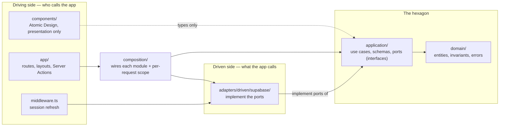
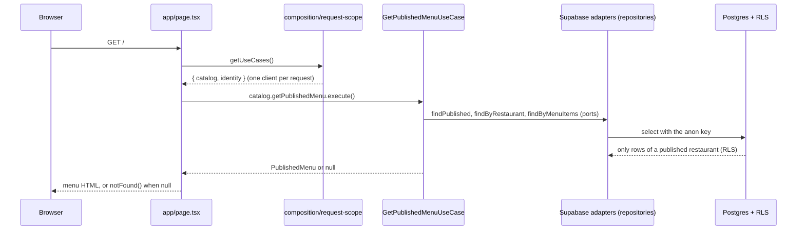
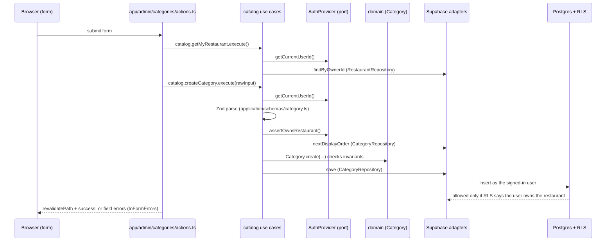
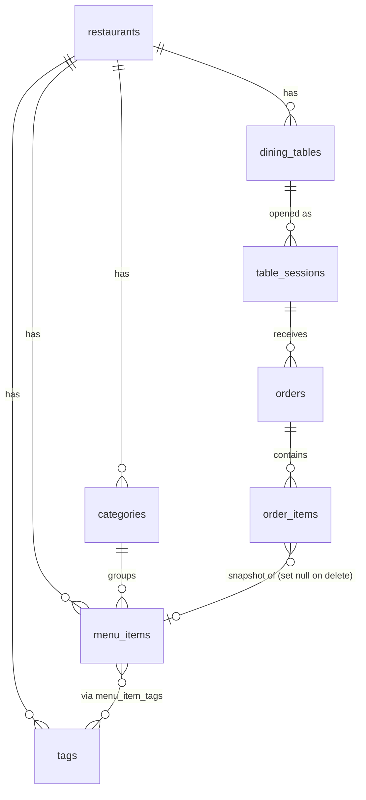
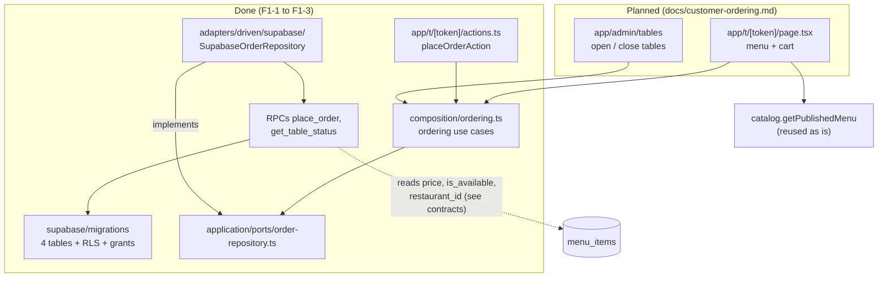

# Architecture map

How the app is put together today, and where Feature 1 (customer ordering) plugs in. For the reasoning behind the rules and a worked example, see [`architecture.md`](architecture.md); this file is the map.

**The one rule:** modules and layers talk to each other only through an explicit interface (a port, or a module's `UseCases` object). Nothing reaches "behind" another module's back — and `pnpm lint` fails if it tries (see [What the linter enforces](#what-the-linter-enforces)). The one deliberate exception is written down in [Contracts between modules](#contracts-between-modules).

## 1. Layers



Every arrow points inward. `domain/` imports nothing from the app; `application/` imports only `domain/` and its own ports; `adapters/` implement ports but never call use cases; `app/` never sees an adapter or the Supabase SDK — it only gets use cases from `composition/request-scope.ts`.

## 2. Modules

The folders are layer-first (`domain/`, `application/`, `adapters/`), so a module is a *slice across the layers*, made visible in `composition/` (one file per module) and in what `getUseCases()` returns.

| Module | What it owns | Use cases (`application/use-cases/`) | Ports it uses | Adapter | Tables |
|---|---|---|---|---|---|
| **identity** | Who is signed in | `sign-in`, `sign-out`, `get-current-user` | `AuthProvider` | `SupabaseAuthProvider` | `auth.users` (Supabase) |
| **catalog** | The restaurant, its menu, and the public read model | `create/list/update/delete-category`, `create/list/update/delete-menu-item`, `get-my-restaurant`, `update-restaurant`, `sync-menu-item-tags`, `list-menu-item-tags`, `get-published-menu` | `RestaurantRepository`, `CategoryRepository`, `MenuItemRepository`, `TagRepository`, `AuthProvider` | `Supabase*Repository` | `restaurants`, `categories`, `menu_items`, `tags`, `menu_item_tags` |
| **ordering** *(Feature 1 — schema, RPCs and `placeOrder` done; `get-table-status` and table admin planned)* | Tables, table sessions, orders | `place-order`; *planned:* `get-table-status`, open/close table | `OrderRepository` | `SupabaseOrderRepository` (calls `place_order`; *planned:* `get_table_status`) | `dining_tables`, `table_sessions`, `orders`, `order_items` |

What `app/` receives per request (`composition/request-scope.ts`):

```ts
const { catalog, identity, ordering } = await getUseCases();
await catalog.createCategory.execute(input);     // never a client, never an adapter
const user = await identity.getCurrentUser.execute();
```

Modules depend on each other **only through a port**: every authenticated catalog use case takes the `AuthProvider` port (identity's capability) rather than calling identity code (the one that doesn't is the deliberately public `get-published-menu`). Adding `ordering` adds a third property to `UseCases`; nothing else in `app/` changes shape.

## 3. Request flows today

### Public menu (`GET /`, no login)



### Admin write (`createCategoryAction`)



Two independent walls guard every write: the use case checks ownership through `AuthProvider` first (fast, typed errors), and RLS enforces it again in the database. Neither is trusted alone.

Sign-in state has two gates on `/admin/*`, on purpose: `middleware.ts` refreshes the session cookie and redirects any request without a user to `/login` (fast, before rendering), and `app/admin/layout.tsx` checks again through `identity.getCurrentUser` — `null` means `redirect("/login")` (the redirect lives in `app/`; the use case only reports "nobody is signed in"). The middleware is a convenience, not the security boundary: the use cases and RLS still check on every write.

## 4. Data model (current schema)



`restaurant_id` is denormalized onto most tables so RLS policies stay a single-column check (single-tenant today, multi-tenant-ready by schema). `anon` has only `SELECT` on the five menu tables and **no** access at all to the four ordering tables. (Locally, and on the hosted project since 2026-09-21, when `20260921120000_tighten_existing_grants.sql` was applied there.)

## 5. Where Feature 1 plugs in (planned unless marked done)



Customers never touch the tables: the ordering adapter calls two RPCs, and each RPC re-validates everything (token, open session, item availability, price) because it is callable with the public anon key.

## 6. Contracts between modules

| Between | Contract | Where it is enforced | If you change it |
|---|---|---|---|
| any module → identity | `AuthProvider` port (`getCurrentUser`, `getCurrentUserId`, `assertOwnsRestaurant`, `signIn`, `signOut`) | TypeScript (port) + lint | Update `SupabaseAuthProvider`, the `FakeAuthProvider` in `application/__tests__/fakes.ts`, and every use case that needs the new capability |
| `app/` → any module | The module's `*UseCases` type in `composition/<module>.ts` | TypeScript + lint (`app/` cannot import adapters) | Add the capability to the module's type and to `catalogUseCases`/`identityUseCases`; `app/` picks it up through `getUseCases()` |
| **ordering → catalog (at the database, by design)** | `place_order` reads `menu_items.id`, `.name`, `.price`, `.is_available`, `.restaurant_id` and `restaurants.is_published` | SQL + integration tests (`place-order.integration.test.ts`) | Changing or renaming any of those columns **also** means changing `place_order` and its tests |

The last row is the one place where a module reaches into another module's data without a TypeScript interface. It is intentional: price and availability must be validated inside the database transaction because the RPC is callable directly with the anon key, so the application layer cannot be the one to check them. Keeping it in this table is what stops it from being a hidden dependency.

## 7. If something breaks, look here

| Symptom | Start at |
|---|---|
| Wrong or missing data on the public menu | `application/use-cases/get-published-menu.ts`, the repositories in `adapters/driven/supabase/`, RLS policies in `supabase/migrations/` |
| A form accepts or rejects the wrong input | `application/schemas/*` and the use case that parses it |
| Someone can do something they shouldn't | RLS policies and grants in `supabase/migrations/`, `AuthProvider`, and the access tests in `adapters/driven/supabase/__tests__/`; to inspect the real grants (including privileges the API can't probe) use the SQL check in [`build-plan.md`](build-plan.md), 6c |
| Login, logout or redirect problems | identity module: `SupabaseAuthProvider`, `app/login/`, `app/admin/layout.tsx`, `middleware.ts` |
| Users see a raw or confusing error | `SupabaseAdapterError` in `adapters/driven/supabase/errors.ts` (what adapters throw), the domain errors in `domain/errors/`, and `toFormErrors` in `app/admin/action-helpers.ts` (what reaches the form) |
| `pnpm lint` says an import is restricted | The message names the rule; the fix is to go through the interface it points to, not to silence it |
| An order is rejected, or its total is wrong | `supabase/migrations/20260921130000_ordering_rpcs.sql` and `place-order.integration.test.ts` (the error codes are the RPC's `message`) |
| Env/config missing at startup | `lib/env.ts` |

## 8. What the linter enforces

Configured in `eslint.config.mjs` (`@typescript-eslint/no-restricted-imports`, no extra dependency). Tests are exempt, because integration tests build real adapters on purpose.

| Layer | May not import |
|---|---|
| `domain/` | `application/`, `lib/`, adapters, composition, `app/`, `components/`, Next, React, the Supabase SDK |
| `application/` | `lib/`, adapters, composition, `app/`, `components/`, Next, React, the Supabase SDK |
| `adapters/` | `app/`, `components/`, `composition/`, `application/use-cases/` (ports and domain are fine) |
| `composition/` | `app/`, `components/`; the Supabase SDK **type-only** |
| `app/` | `adapters/`, the Supabase SDK, and a module's own factories (`composition/catalog`, `identity`, `container`) — it uses `composition/request-scope` only |
| `components/` | adapters, composition, `app/`, the SDK; `application/` and `domain/` **type-only** |
| `middleware.ts` | the Supabase SDK (it may call `adapters/driven/supabase/middleware-client`) |

Every layer folder also bans any import with a `..` segment (`../x`, `./../x`, a bare `..`): the patterns only see `@/` aliases, so a relative path would slip past them. Each rule was checked by adding a forbidden import on purpose and confirming lint fails; they are not just documentation.

## 9. Adding a capability (checklist)

1. Domain: entity or invariant, if there is a real rule (`domain/`).
2. Port: the interface the use case needs, in the domain's language, no SDK types (`application/ports/`).
3. Use case + Zod schema (`application/use-cases/`, `application/schemas/`), with a unit test against an in-memory fake (`application/__tests__/fakes.ts`).
4. Adapter implementing the port (`adapters/driven/supabase/`), with an integration test.
5. Wire it in the module's file (`composition/<module>.ts`) and add it to that module's `*UseCases` type.
6. Call it from `app/` through `getUseCases()`. If the linter complains, you skipped a step.

## 10. Known debts

- **No lint rule between modules yet.** Only two modules exist and they meet through a port. When `ordering` lands, add a rule (or per-module folders) so ordering code cannot import catalog use cases directly.
- **Layer-first folders.** Module boundaries are visible in `composition/` and `getUseCases()`, not in the folder tree. Module-first folders (`modules/catalog/{domain,application,adapters}`) were considered and not done: a large move that contradicts `architecture.md`, and not needed to enforce the boundaries above.
- **Lint gaps.** Not covered by the boundary rules: dynamic `import()`, and files outside the layer folders (`lib/`, `scripts/`). `*.spec.*` files are not in the test exemptions (there are none). Nothing in the repo uses any of these today.
- **Pass-through use cases** (`sign-out`, `get-current-user`) carry no logic. They exist so `app/` never touches a port or an adapter directly.
- **Multi-tenant.** Known items are collected in [`build-plan.md`](build-plan.md), section 7.
