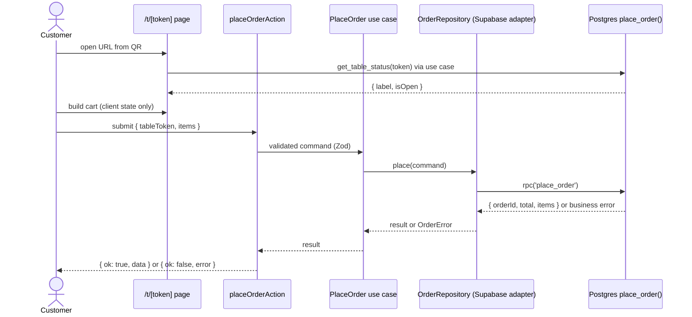

# Feature 1: Customer Ordering

**Status:** planned
**Depends on:** public menu view (done), admin CRUD + auth (done)
**Recommended before starting:** test runner + CI baseline (build-plan Steps 5-6), so this feature lands behind a pipeline. Not a hard blocker.

## 1. Goal and scope

A customer sitting at a table opens a table-specific URL (encoded in a QR), builds a cart from the public menu, and submits an order. The order is stored in the DB as `placed`. Nothing else happens in this feature.

| In scope | Out of scope (later features or deliberately cut) |
|---|---|
| Table-specific URL `/t/<qr_token>` | Kitchen display, status changes past `placed` (Feature 2) |
| Client-side cart (IDs + quantities + notes) | Waiter notifications (Feature 3) |
| Atomic order placement via Postgres RPC | Live order status for the customer |
| Server-side validation and price calculation | Payments, bill, splitting: the restaurant handles these |
| Table sessions (admin opens/closes a table) | OTP, accounts or login for customers |
| Admin page to open/close tables | Table CRUD UI, QR image generation (seeded for now) |
| Snapshot of name and price on each order line | Editing an order after placing it |

## 2. Flow



Page behavior by table state:
- Unknown token: `notFound()`.
- Known token, no open session: menu renders read-only, banner "Ordering isn't available yet. Ask your waiter." Add-to-cart is disabled.
- Known token, open session: full ordering.

## 3. Data model

New migration. Follows existing conventions: UUID PKs, `numeric(10,2)` for money, `restaurant_id` denormalized for RLS.

Note: the table is named `dining_tables`, not `tables`, to avoid confusion with SQL/Supabase "table" terminology.

```sql
create type order_status as enum
  ('placed', 'preparing', 'ready', 'served', 'cancelled');
-- Feature 1 only ever writes 'placed'. The full enum is created now so
-- Feature 2 doesn't need an enum migration.

create table dining_tables (
  id            uuid primary key default gen_random_uuid(),
  restaurant_id uuid not null references restaurants(id) on delete cascade,
  label         text not null,
  qr_token      text not null unique
                default replace(gen_random_uuid()::text, '-', ''),
  created_at    timestamptz not null default now(),
  unique (restaurant_id, label)
);

create table table_sessions (
  id              uuid primary key default gen_random_uuid(),
  restaurant_id   uuid not null references restaurants(id) on delete cascade,
  dining_table_id uuid not null references dining_tables(id) on delete cascade,
  opened_at       timestamptz not null default now(),
  closed_at       timestamptz
);
create unique index one_open_session_per_table
  on table_sessions (dining_table_id) where closed_at is null;

create table orders (
  id            uuid primary key default gen_random_uuid(),
  restaurant_id uuid not null references restaurants(id) on delete cascade,
  session_id    uuid not null references table_sessions(id),
  status        order_status not null default 'placed',
  total         numeric(10,2) not null check (total >= 0),
  placed_at     timestamptz not null default now()
);
create index orders_session_status_idx on orders (session_id, status);

create table order_items (
  id            uuid primary key default gen_random_uuid(),
  order_id      uuid not null references orders(id) on delete cascade,
  restaurant_id uuid not null references restaurants(id) on delete cascade,
  menu_item_id  uuid references menu_items(id) on delete set null,
  name          text not null,                 -- snapshot
  unit_price    numeric(10,2) not null,        -- snapshot
  quantity      int not null check (quantity between 1 and 20),
  notes         text check (char_length(notes) <= 200)
);
create index order_items_order_idx on order_items (order_id);
```

### Why snapshot name and price
An order is a historical record. Without the snapshot, editing a price rewrites past orders, renaming an item changes what an old order says, and deleting a menu item breaks the FK (or leaves nameless lines). `menu_item_id` is `on delete set null` so history survives deletes.

### Access model
The QR token is a **credential**. Anyone who can read `dining_tables` can read every token, so `anon` gets **no** direct access to any of these tables.

| Actor | `dining_tables` | `table_sessions` | `orders` / `order_items` | RPCs |
|---|---|---|---|---|
| anon (customer) | none | none | none | execute `place_order`, `get_table_status` |
| authenticated admin | CRUD | CRUD | select | execute both |

- `enable row level security` on all four tables.
- Admin policies: mirror the pattern already used on `menu_items`.
- Explicit `GRANT`s to `authenticated` only (Supabase does not auto-expose new tables). Grant nothing to `anon`.

## 4. Database API (RPCs)

Both functions: `language plpgsql`, `security definer`, `set search_path = public`. They run as the function owner and bypass RLS on the tables above, so **each function must do all its own validation**.

After creating each function:
```sql
revoke all on function place_order(text, jsonb) from public;
grant execute on function place_order(text, jsonb) to anon, authenticated;
-- same for get_table_status(text)
```
Postgres grants `EXECUTE` to `PUBLIC` by default, so the revoke is not optional.

### `get_table_status(p_qr_token text)`
Returns `table (label text, is_open boolean)`. Zero rows means invalid token. Exposes the label and open state without ever exposing tokens.

### `place_order(p_qr_token text, p_items jsonb)`
Input `p_items`: `[{ "menuItemId": uuid, "quantity": int, "notes": text? }]`.

Success returns `jsonb`:
```json
{
  "orderId": "uuid",
  "total": 12.50,
  "placedAt": "2026-09-18T15:04:05Z",
  "items": [{ "name": "Latte", "unitPrice": 3.50, "quantity": 2, "notes": null }]
}
```
The confirmation screen renders **only** from this response, so what the customer sees is exactly what was stored.

Algorithm:
1. Validate payload: `jsonb_typeof = 'array'`, 1-30 lines, quantity 1-20, no duplicate `menuItemId`. Otherwise raise `invalid_items`.
2. Resolve token to `dining_tables`. Not found: `invalid_table`.
3. Find and lock the open session (see snippet 1). None: `table_closed`.
4. Count orders in the session with status `placed`, `preparing` or `ready`. If >= 5: `too_many_open_orders`. `served` and `cancelled` don't count.
5. Find requested items that are not orderable (see snippet 2). If any: raise `items_unavailable` with the offending IDs in `detail`.
6. Insert `orders` (total computed in SQL from `menu_items.price * quantity`), then `order_items` with snapshots.
7. Return the jsonb above.

**Snippet 1: lock the session so the cap can't be raced.** Two concurrent calls could both count 4 open orders and both insert.
```sql
select * into v_session
from table_sessions
where dining_table_id = v_table.id and closed_at is null
for update;
```

**Snippet 2: which requested items are not orderable.**
```sql
select array_agg(r."menuItemId") into v_bad
from jsonb_to_recordset(p_items)
       as r("menuItemId" uuid, quantity int, notes text)
left join menu_items m on m.id = r."menuItemId"
where m.id is null
   or not (m.is_published and m.is_available)
   or m.restaurant_id <> v_table.restaurant_id;
```
(Adjust column names to your actual `menu_items` schema.)

Errors are raised with `raise exception '<code>' using detail = '<json>'`. Machine-readable code in `message`, extra data in `detail`. Any failure rolls back the whole function, so orders and lines are all-or-nothing.

### Decision: RPC is callable by `anon`, not `service_role`
The alternative is revoking `anon` and calling the RPC with the service-role key from the server. Chosen approach avoids handling a service key (another secret in Docker, Vercel and CI) and keeps the DB as the single enforcement point. Trade-off: anyone with the public anon key can call the RPC directly, bypassing the Zod/use-case layer. That is acceptable because the token plus an open session is the capability, and the function validates everything itself. Zod and the use case give early, typed feedback; they are not the security boundary.

## 5. Application layer (hexagonal)

Respects the existing rules: only `adapters/driven/supabase/` imports `@supabase/supabase-js`; only `composition/container.ts` wires things; Server Actions in `app/**/actions.ts` are the driving adapter. Folder names below other than those are suggestions; match your existing layout.

```
domain/order/errors.ts                 OrderError codes (union type)
application/ports/OrderRepository.ts   place(cmd), getTableStatus(token)
application/use-cases/placeOrder.ts
application/use-cases/getTableStatus.ts
adapters/driven/supabase/orderRepository.ts   supabase.rpc(...) + error mapping
composition/container.ts               wire use cases to the adapter
app/t/[token]/actions.ts               placeOrderAction (driving adapter)
```

**Public actions:** `authedAction(schema, handler)` requires a session, so add a sibling `publicAction(schema, handler)` that does Zod parse, calls the handler and maps errors, without the auth check.

**Zod schema.** This payload is JSON from a client-called Server Action, not `FormData`, so no `z.coerce` is needed.
```ts
export const placeOrderSchema = z.object({
  tableToken: z.string().min(1).max(64),
  items: z
    .array(
      z.object({
        menuItemId: z.string().uuid(), // z.uuid() on Zod 4
        quantity: z.number().int().min(1).max(20),
        notes: z.string().trim().max(200).optional(),
      })
    )
    .min(1)
    .max(30)
    .refine(
      (items) => new Set(items.map((i) => i.menuItemId)).size === items.length,
      { message: "duplicate_items" }
    ),
});
```

**Action result:** never throw business errors. Return a discriminated union so `useActionState` can render them.
```ts
type PlaceOrderResult =
  | { ok: true; data: { orderId: string; total: number; placedAt: string;
        items: { name: string; unitPrice: number; quantity: number; notes: string | null }[] } }
  | { ok: false; error:
        | { code: "invalid_table" }
        | { code: "table_closed" }
        | { code: "too_many_open_orders" }
        | { code: "items_unavailable"; itemIds: string[] }
        | { code: "invalid_items" }
        | { code: "unexpected" } };
```

**Adapter error mapping:** `supabase.rpc('place_order', ...)` returns `{ data, error }`. If `error.message` is one of the known codes, map it to the domain error (parsing `error.details` for `itemIds`). Anything else becomes `unexpected` and is logged server-side.

## 6. Cart (client state)

The cart holds IDs, quantities and notes. **Never prices.**

```ts
type CartLine = { menuItemId: string; quantity: number; notes?: string };

type CartAction =
  | { type: "add"; menuItemId: string }
  | { type: "setQty"; menuItemId: string; quantity: number } // 0 removes the line
  | { type: "setNotes"; menuItemId: string; notes: string }
  | { type: "removeMany"; menuItemIds: string[] }             // after items_unavailable
  | { type: "clear" };
```

- One line per `menuItemId` (reducer merges), quantity capped at 20.
- `CartProvider` (client component) in `app/t/[token]/layout.tsx`, exposed via `useCart()`.
- Persist to `sessionStorage` under `cart:v1:<token>`. **Hydrate in an effect after mount**, not during render, or you get a hydration mismatch.
- Displayed subtotal is computed in the UI from the already-loaded menu data. It is cosmetic. If a cart line's item is missing from the loaded menu, drop it.
- On success: show confirmation from the server response, then `clear`.
- On `items_unavailable`: flag those lines, offer remove (`removeMany`), keep the rest.
- Disable the submit button while the action is pending (covers double-tap).

## 7. Routes and UI

| Route | Purpose |
|---|---|
| `/t/[token]` | Customer menu + cart for that table |
| `/admin/tables` | List tables, Open/Close, show the `/t/<token>` link for dev testing |

Atomic Design placement (reuse existing atoms and molecules from the menu view):
- **Atoms:** existing buttons, badges. Add a quantity stepper if you don't have one.
- **Molecules:** `AddToCartButton`, `CartLineItem`.
- **Organisms:** `CartSummary` (drawer or sticky bar), `OrderConfirmation`.
- **Template/page:** `TableMenuTemplate`, `/t/[token]/page.tsx` (server component: resolves table status, loads menu, renders the client cart boundary).

Admin actions (`authedAction`):
- `openTable(diningTableId)`: insert session. Unique-index violation (`23505`) maps to `already_open`.
- `closeTable(diningTableId)`: set `closed_at = now()` where `closed_at is null`.

## 8. Error to UI behavior

| Error | UI |
|---|---|
| `invalid_table` (at load) | 404 page |
| `invalid_table` (at submit) | "This table link is no longer valid." Keep cart. |
| `table_closed` | Banner: ordering unavailable, ask the waiter. Keep cart, disable submit. |
| `too_many_open_orders` | "You have several orders in progress. Wait for them to arrive or ask your waiter." Keep cart. |
| `items_unavailable` | Flag listed lines, offer removal. Keep the rest. |
| `invalid_items` | Generic "something went wrong with your cart". Log it. |
| `unexpected` | Generic retry message. Keep cart. |

## 9. Testing plan

### DB integration tests (against local Supabase, real Postgres)
`place_order`:
1. Happy path: `orders` + `order_items` rows exist, snapshots correct, `total = sum(price * qty)`.
2. Unpublished item: `items_unavailable` with that ID.
3. `is_available = false` item: `items_unavailable`.
4. Unknown menu item ID: `items_unavailable`.
5. Invalid token: `invalid_table`.
6. No open session: `table_closed`.
7. Cap: 5 open orders succeed, 6th fails with `too_many_open_orders`; `served`/`cancelled` orders don't count.
8. Concurrency: fire ~10 parallel calls against a session with 3 open orders; assert never more than 5 open orders (proves the row lock).
9. Atomicity: install a test-only trigger on `order_items` that raises; assert no `orders` row remains.
10. Snapshot: place an order, change the item's price and name, assert `order_items` unchanged.
11. Payload validation: empty array, >30 lines, duplicate IDs, quantity 0 and 21 all give `invalid_items`.

Access control:
12. `anon` client cannot insert into or select from `orders`, `order_items`, `table_sessions`, `dining_tables`.
13. `anon` can execute both RPCs.
14. `get_table_status`: valid open, valid closed, invalid token (zero rows).
15. Only one open session per table (second insert fails).

### Unit tests
- Cart reducer: add, merge, setQty (0 removes, clamps at 20), setNotes, removeMany, clear.
- `placeOrderSchema`: accepts valid, rejects bad UUID, quantity bounds, duplicates, oversized notes.
- `PlaceOrder` use case with a fake `OrderRepository`.
- Adapter error mapping with mocked `supabase.rpc` error shapes (each code, plus unknown becoming `unexpected`).

### E2E
No separate e2e for this feature alone. The one e2e (customer orders, kitchen marks ready, waiter marks served) is completed after Features 2-3.

## 10. Implementation tasks

Each task should be a separate Claude Code session with tests written in the same session.

| # | Task | Done when |
|---|---|---|
| F1-1 | Migration (tables, enum, indexes, RLS, grants) + dev seed | Applies cleanly to a fresh DB. Seed creates 3 tables with readable tokens (`dev-table-1..3`) and an open session on each. `anon` has no direct access. |
| F1-2 | `place_order` + `get_table_status` RPCs + integration tests | Tests 1-15 above pass in CI-runnable form. |
| F1-3 | Domain errors, port, use cases, Supabase adapter, Zod schema, `publicAction`, `placeOrderAction` | Unit tests for schema, use case and error mapping pass. Architecture rules still hold. |
| F1-4 | `/admin/tables`: list, open, close, dev link | Open on an already-open table fails cleanly. Admin-only. |
| F1-5 | Cart reducer + provider + `sessionStorage` persistence | Reducer unit tests pass. No hydration warnings. |
| F1-6 | `/t/[token]` page: table status, read-only mode, cart UI, submit, confirmation, error handling | Manual flow: open table in admin, order from `/t/dev-table-1`, see row in DB. Each error in section 8 reachable and handled. |

Start with F1-1 to F1-3. Everything else depends on the RPC contract.

## 11. Dev setup

- Seed tokens are readable (`dev-table-1`) so you can open `localhost:3000/t/dev-table-1` directly. A QR is just that URL encoded, so no scanning is needed in development.
- Seed with **local/dev only**. Production tokens use the column default (random, ~122 bits).
- Open a table in `/admin/tables` before testing the order flow.

## 12. Design decisions (interview notes)

- **Why an RPC and not two inserts?** `supabase-js` has no client-side transactions and `orders` + `order_items` must be atomic. A plpgsql function gives one transaction and one place for validation.
- **Why validate in both the DB and the app?** The RPC is callable directly with the anon key, so the DB is the security boundary. Zod and the use case exist for fast, typed feedback and testability.
- **Why not trust client prices?** The client only sends IDs and quantities; price and availability come from `menu_items` inside the transaction.
- **Why snapshot name and price?** Orders are historical records; catalog edits must not rewrite them.
- **Why sessions instead of rate limiting or OTP?** A rate limit doesn't stop a remote spammer with a QR photo, and an OTP printed on the QR protects nothing. The waiter opening the table is the out-of-band step, and it also scopes orders per meal.
- **Why `for update` on the session?** Without it, concurrent orders can both pass the "max 5 open orders" check.
- **Why no public read on `dining_tables`?** The token is a credential; the `get_table_status` RPC exposes only label and open state.
- **Why `security definer` + `set search_path` + `revoke ... from public`?** It runs with owner privileges, so it must pin the search path (avoid hijacking via schema objects) and restrict who can execute it.

## 13. Known gaps (deliberately deferred)

- **Stale sessions:** if a waiter forgets to close a table, its QR stays live. Fix later: treat sessions older than N hours as closed in the RPC, and have "open table" auto-close a stale one.
- **No idempotency key:** a network retry could create a duplicate order. Disabling the button while pending covers most cases. Hardening: client-generated `idempotency_key`, unique per session.
- **No live order status** for the customer, and the confirmation screen is not persisted across reloads.
- **Cap of 5 open orders** is a constant in the function; move to config only if it matters.
- **No price-drift confirmation** ("prices changed, review your order"). The confirmation shows the authoritative server snapshot instead.